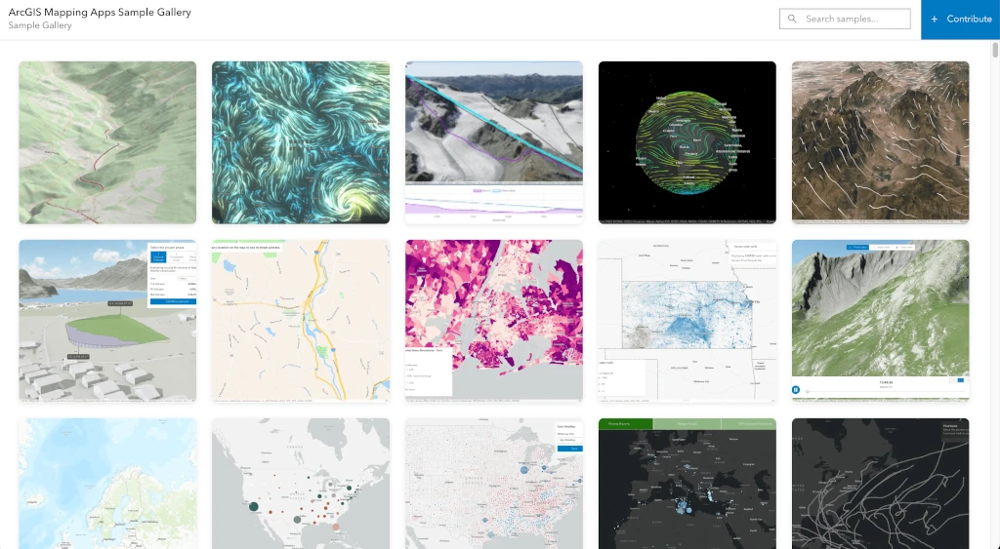

# ArcGIS Developers Samples

[](https://hhkaos.github.io/arcgis-developers-samples/)
[](LICENSE)
[](CONTRIBUTING.md)

Responsive gallery showcasing sample applications built with ArcGIS.



## ✨ Features

- **Responsive Grid Layout**: Automatically adapts from 1-3 columns based on screen size
- **Fuzzy Search**: Real-time search across sample names, descriptions, and tags
- **Interactive Cards**: Hover overlays with quick access buttons
- **Lazy Loading**: Optimized performance with lazy-loaded images and videos
- **Accessible**: Full keyboard navigation and ARIA labels
- **Modal Details**: Detailed view with full descriptions and metadata
- **Mobile-Friendly**: Touch-optimized interactions for mobile devices

## 🚀 Quick Start

### View Live Demo

Visit the [live demo](https://www.rauljimenez.info/arcgis-developers-samples/) hosted on GitHub Pages.

### Run Locally

1. **Clone the repository**
   ```bash
   git clone https://github.com/hhkaos/arcgis-developers-samples.git
   cd arcgis-developers-samples
   ```

2. **Serve the files**
   
   Using Python:
   ```bash
   python -m http.server 8000
   ```
   
   Using Node.js:
   ```bash
   npx serve
   ```
   
   Or use any static file server.

3. **Open in browser**
   ```
   http://localhost:8000
   ```

## 📁 Project Structure

```
arcgis-developers-samples/
├── index.html              # Main HTML file
├── app.js                  # Application logic
├── styles.css              # Custom styles
├── data/
│   └── apps.json          # Sample apps data
├── assets/                # Media files (images, GIFs, videos)
│   ├── preview.png
│   ├── building-3d.jpg
│   ├── weather-viz.gif
│   └── ...
├── README.md              # This file
├── CONTRIBUTING.md        # Contribution guidelines
└── LICENSE                # Apache 2.0 license
```

## 📊 JSON Schema

Each sample app in `data/apps.json` follows this schema:

```json
{
  "name": "string, required",
  "description": "string, required - detailed description",
  "mediaType": "image | gif | video",
  "media": "string, required - URL or relative path to image/GIF/video (for images and GIFs Webp is recommended)",
  "previewMedia": "string, required for videos",
  "samplelink": "string, required - URL to the live sample",
  "codeLink": "string, optional - URL to source code",
  "tags": ["array of strings"]
}
```

### Example Entry

```json
{
    "name": "Real-Time Path Updates",
    "description": "Shows how to update an existing feature on the map in real time. In this example, a polyline is extended with new coordinates to show the live progression of a path, a pattern often used for tracking or streaming data sources.",
    "mediaType": "video",
    "media": "./assets/animated-dotted-line-3d.mp4",
    "previewMedia": "./assets/animated-dotted-line-3d.webp",
    "samplelink": "https://codepen.io/hhkaos/pen/ByKPXMq/live",
    "codeLink": "https://codepen.io/hhkaos/pen/ByKPXMq/live",
    "tags": [
      "real time",
      "feature update",
      "editing",
      "tracking",
      "live data",
      "line",
      "polyline",
      "animation",
      "ArcGIS Maps SDK for JavaScript"
    ]
  }
```

## 🎯 Adding New Samples

1. Add your media file to the `assets/` directory
2. Add a new entry to `data/apps.json` following the schema
3. Test locally
4. Submit a pull request (see [CONTRIBUTING.md](CONTRIBUTING.md))

## 🛠️ Technology Stack

- **Vanilla JavaScript** (ES6+)
- **HTML5** with semantic markup
- **CSS3** with Grid and Flexbox
- **[Calcite Design System](https://developers.arcgis.com/calcite-design-system/)** - Esri's design system
- **IntersectionObserver API** for lazy loading
- **GitHub Pages** for hosting

## 🤝 Contributing

We welcome contributions! Please see [CONTRIBUTING.md](CONTRIBUTING.md) for:

## 📝 License

This project is licensed under the Apache License 2.0.

## 🙏 Acknowledgments

- Built with [Calcite Design System](https://developers.arcgis.com/calcite-design-system/)
- Sample apps from [ArcGIS Maps SDK for JavaScript](https://developers.arcgis.com/javascript/)
- Icons from [Calcite UI Icons](https://developers.arcgis.com/calcite-design-system/icons/)

## 📧 Support

- **Issues**: [GitHub Issues](https://github.com/hhkaos/arcgis-developers-samples/issues)
- **Discussions**: [GitHub Discussions](https://github.com/hhkaos/arcgis-developers-samples/discussions)
- **ArcGIS Community**: [Esri Community Forums](https://community.esri.com/)

## 🔗 Related Resources

- [ArcGIS Developer Portal](https://developers.arcgis.com/)
- [Calcite Design System Documentation](https://developers.arcgis.com/calcite-design-system/)

---

Made with ❤️ by the ArcGIS community